# Data Model

**Project**: KMA OS / sys-cli
**Generated**: 2026-06-22

---

## Entity Relationship Diagram

```mermaid
erDiagram
    prot_entry {
        unsigned_long ino PK
        dev_t dev PK
        hlist_node node
        rcu_head rcu
    }
    CovertFramingCtx {
        covert_framing_state state
        u8_ptr message
        size_t msg_len
        size_t pos
    }
    PacketInfo {
        iphdr_ptr iph
        tcphdr_ptr tcph
        udphdr_ptr udph
        be32 src_ip
        be32 dst_ip
        be16 src_port
        be16 dst_port
        u8 protocol
    }
    FirewallRule {
        string field PK
        string value
    }
    CronJob {
        int index PK
        string min
        string hour
        string day
        string month
        string wday
        string cmd
    }
    CovertFramingCtx ||--o{ PacketInfo : "byte embedded into"
```

---

## Entities

### MODEL001_ProtEntry

**Description**: Kernel hash-table node representing a single VFS-protected directory inode. Stored in `prot_ht` (RCU hash table, 4096 buckets). Lookups are lockless via RCU; inserts/deletes use `prot_lock` spinlock.

**Source**: `KMA-OS/kernel-modules/kma-vfs-guard/kma-vfs-guard.c:29-34`

| Attribute | Type | Constraints | Description |
|-----------|------|-------------|-------------|
| ino | unsigned long | PK (composite) | Inode number of protected directory |
| dev | dev_t | PK (composite) | Device ID of the filesystem containing the inode |
| node | struct hlist_node | NOT NULL | Hash table linkage (RCU-safe) |
| rcu | struct rcu_head | NOT NULL | RCU deferred-free callback head |

**Relationships**:
- Many entries stored in global `prot_ht` hash table (DEFINE_HASHTABLE, HT_BITS=12)

**Discriminator Fields**: None.

**Validation Rules**:

| Rule | Field | Constraint | Error Message |
|------|-------|------------|---------------|
| unique composite key | ino + dev | No duplicate (ino, dev) pairs | entry silently skipped if already present |
| path must resolve | add_path sysfs write | kern_path() must succeed | -ENOENT returned to sysfs caller |
| must be directory | add_path sysfs write | S_ISDIR(inode->i_mode) | -ENOTDIR returned |

---

### MODEL002_CovertFramingCtx

**Description**: Per-message sender-side framing context for steganographic channel embedding. Tracks the four-state send sequence: IDLE → SEND_START → SEND_DATA → SEND_END. Used by tcp_embed and udp_embed subsystems to serialize message bytes with start/end markers (0xFF00 / 0x00FF).

**Source**: `package-hiding/src/covert/framing.h:31-36`

| Attribute | Type | Constraints | Description |
|-----------|------|-------------|-------------|
| state | enum covert_framing_state | NOT NULL | Current framing FSM state |
| message | const u8 * | nullable | Pointer to raw message bytes (NULL when IDLE) |
| msg_len | size_t | NOT NULL | Total message length in bytes |
| pos | size_t | NOT NULL | Current byte position within message |

**Discriminator Fields**:

| Field | DISC-### | Values | Description |
|-------|----------|--------|-------------|
| state | DISC-001 | COVERT_FRAM_IDLE, COVERT_FRAM_SEND_START, COVERT_FRAM_SEND_DATA, COVERT_FRAM_SEND_END | Controls which byte is produced by covert_framing_next_byte: idle=no output, SEND_START=0xFF00 marker, SEND_DATA=message[pos], SEND_END=0x00FF marker |

**Validation Rules**:

| Rule | Field | Constraint | Error Message |
|------|-------|------------|---------------|
| no double-queue | global pending | Must be IDLE before set_message | covert_framing_set_message returns -BUSY |
| non-null message | message | Must be non-NULL when state != IDLE | caller contract; no runtime guard documented |

---

### MODEL003_PacketInfo

**Description**: Parsed packet metadata extracted from a Linux `sk_buff`. Populated by `covert_parse_packet`. Used by embed/extract functions and `covert_is_target_packet` to select packets for covert channel operations.

**Source**: `package-hiding/src/covert/packet_parser.h:12-21`

| Attribute | Type | Constraints | Description |
|-----------|------|-------------|-------------|
| iph | struct iphdr * | NOT NULL | Pointer to IP header within sk_buff |
| tcph | struct tcphdr * | nullable | Pointer to TCP header; NULL for UDP packets |
| udph | struct udphdr * | nullable | Pointer to UDP header; NULL for TCP packets |
| src_ip | __be32 | NOT NULL | Source IP address (network byte order) |
| dst_ip | __be32 | NOT NULL | Destination IP address (network byte order) |
| src_port | __be16 | NOT NULL | Source port (network byte order) |
| dst_port | __be16 | NOT NULL | Destination port (network byte order) |
| protocol | __u8 | NOT NULL | IPPROTO_TCP (6) or IPPROTO_UDP (17) |

**Discriminator Fields**:

| Field | DISC-### | Values | Description |
|-------|----------|--------|-------------|
| protocol | DISC-002 | IPPROTO_TCP, IPPROTO_UDP | Determines which embed/extract function is invoked: TCP uses seq number lower-byte, UDP uses IP ID field lower-byte |

**Validation Rules**:

| Rule | Field | Constraint | Error Message |
|------|-------|------------|---------------|
| parse success | iph | Must not be NULL after parse | covert_parse_packet returns -1 |
| protocol support | protocol | Must be IPPROTO_TCP or IPPROTO_UDP | covert_parse_packet returns -1 for other protos |

---

### MODEL004_TcpEmbedConfig

**Description**: Implicit configuration for TCP steganographic embedding. No struct defined — the embedding strategy is fixed by the tcp_embed module: embed one byte into the lower 8 bits of the TCP sequence number, then recalculate IP and TCP checksums. Represented here as a logical model for documentation purposes.

**Source**: `package-hiding/src/covert/tcp_embed.h`

| Attribute | Type | Constraints | Description |
|-----------|------|-------------|-------------|
| target_field | string (logical) | FIXED="tcp_seq_low8" | TCP header field used for embedding: lower 8 bits of seq number |
| embed_byte | u8 | NOT NULL | The covert byte to embed in the seq number |
| checksum_recalc | bool (logical) | ALWAYS TRUE | IP and TCP checksums always recalculated after modification |

**Discriminator Fields**: None.

---

### MODEL005_UdpEmbedConfig

**Description**: Implicit configuration for UDP steganographic embedding. No struct defined — the strategy is fixed: embed one byte into the lower 8 bits of the IP Identification field, then recalculate IP checksum only (UDP checksum unaffected by IP ID). Represented here as a logical model.

**Source**: `package-hiding/src/covert/udp_embed.h`

| Attribute | Type | Constraints | Description |
|-----------|------|-------------|-------------|
| target_field | string (logical) | FIXED="ip_id_low8" | IP header field used: lower 8 bits of IP Identification |
| embed_byte | u8 | NOT NULL | The covert byte to embed |
| checksum_recalc | bool (logical) | ALWAYS TRUE | IP checksum recalculated; UDP checksum not affected |

**Discriminator Fields**: None.

---

### MODEL006_FirewallRule

**Description**: Firewall configuration state as presented by the `ubuntu_firewall` kernel module via sysfs at `/sys/firewall/`. Three attributes constitute the full rule set; they are read and written atomically per attribute. The Web API (`firewall.js`) and CLI (`firewall-mgmt.sh`) both operate on this model.

**Source**: `sys-cli/web/lib/routes/firewall.js:7-11`

| Attribute | Type | Constraints | Description |
|-----------|------|-------------|-------------|
| enabled | string "0"\|"1" | NOT NULL | Master firewall toggle; "1"=active, "0"=inactive |
| drop_icmp | string "0"\|"1" | NOT NULL | ICMP drop flag; "1"=drop all ICMP, "0"=allow |
| reject_ports | string | nullable | Comma-separated port numbers to reject; empty string = no ports blocked |

**Discriminator Fields**: None. (enabled and drop_icmp are boolean toggles — behavioral distinction captured in Business Rules.)

**Validation Rules**:

| Rule | Field | Constraint | Error Message |
|------|-------|------------|---------------|
| toggle field whitelist | field | Must be "enabled" or "drop_icmp" | 400: field must be "enabled" or "drop_icmp" |
| toggle value range | value | Must be 0 or 1 | 400: value must be 0 or 1 |
| port range | reject_ports | Each port 1-65535, comma-separated | 400: Invalid port "X": must be 1-65535 |
| non-empty ports | reject_ports | Cannot be whitespace-only when calling /ports | 400: ports cannot be empty |

---

### MODEL007_CronJob

**Description**: A single user crontab entry as managed by `cron.js` (Web API) and `cron-mgmt.sh` (CLI). Stored in the user's crontab file; accessed via `crontab -l` / `crontab -`. Index is 1-based, counted over non-comment non-empty lines only.

**Source**: `sys-cli/web/lib/routes/cron.js:39-61`

| Attribute | Type | Constraints | Description |
|-----------|------|-------------|-------------|
| index | integer | PK (ephemeral), >= 1 | 1-based position among non-comment crontab lines; recomputed on each read |
| min | string | NOT NULL | Cron minute field (0-59, *, */N, ranges) |
| hour | string | NOT NULL | Cron hour field (0-23, *, */N, ranges) |
| day | string | NOT NULL | Cron day-of-month field |
| month | string | NOT NULL | Cron month field |
| wday | string | NOT NULL | Cron day-of-week field |
| cmd | string | NOT NULL | Shell command to execute |
| entry | string (derived) | NOT NULL | Full crontab line: "{min} {hour} {day} {month} {wday} {cmd}" |

**Discriminator Fields**: None.

**Validation Rules**:

| Rule | Field | Constraint | Error Message |
|------|-------|------------|---------------|
| all schedule fields required | min/hour/day/month/wday | Each must be present | 400: {field} is required |
| cronField validation | each schedule field | Passes validate('cronField') — rejects shell-injection chars | 400 from validator |
| cmd non-empty | cmd | Non-empty string after trim | 400: cmd is required |
| idempotent add | entry | Duplicate full entry is silently skipped | {ok:true, added:false, reason:'already exists'} |
| index in-range | index | 1 <= index <= job count | 400: index N out of range (M jobs) |

---

## Summary

- **Total Entities**: 7
- **Total Discriminator Fields**: 2
- **Kernel-space entities**: prot_entry, CovertFramingCtx, PacketInfo, TcpEmbedConfig, UdpEmbedConfig
- **Application-space entities**: FirewallRule, CronJob
