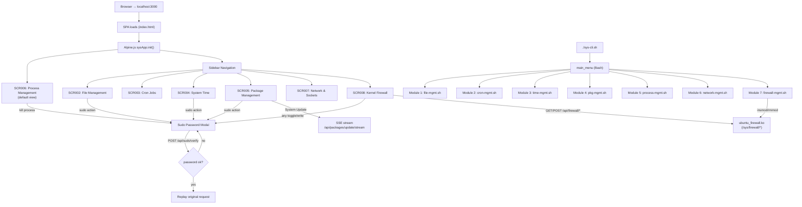

# Screen Flow

**Project**: KMA OS / sys-cli
**Generated**: 2026-06-22

---

## Web UI Flow (sys-cli dashboard — port 3000)

### Entry Point
Browser navigates to `http://localhost:3000`. Express serves `index.html` (SPA catch-all). Alpine.js initializes `sysApp()`, sets `activeModule = 'processes'`, and lazy-loads `/views/processes.html` → **SCR006** rendered immediately.

### Navigation Model
- Single-page app; no URL routing. Navigation = click sidebar item → `loadModule(name)`.
- Views are cached in `this.views[name]` after first load (no re-fetch on revisit).
- Sudo modal (`_askSudoPassword`) intercepts any API call that returns `sudo_required` or `incorrect_password`, collects password, verifies via `POST /api/sudo/verify`, then replays the original request. This is global — all screens share one modal.

### Module Navigation (SCR001 sidebar → screens)

| Sidebar Item | Loads Module | Renders |
|---|---|---|
| Processes | processes | SCR006 |
| Network | network | SCR007 |
| Files | files | SCR002 |
| Cron | cron | SCR003 |
| Time | time | SCR004 |
| Packages | packages | SCR005 |
| Firewall | firewall | SCR008 |

### Screen-Level Flows

**SCR002 — File Management**
```
Enter screen
  └─ User sets treePath + treeDepth → Load Tree → GET /api/files/tree
       └─ Tree rendered (collapsible dirs)
  └─ User enters opPath → chooses action
       ├─ Delete → confirm modal → POST /api/files/delete-path [sudo]
       ├─ Rename → input modal → POST /api/files/rename [sudo]
       ├─ New File → input modal → POST /api/files/create [sudo]
       └─ New Dir → input modal → POST /api/files/create [sudo]
  └─ Large-file finder: dir + size → GET /api/files/large
       └─ Result list → optional delete → POST /api/files/delete
```

**SCR003 — Cron Jobs**
```
Enter screen
  └─ init: GET /api/cron/list + GET /api/cron/now (parallel)
  └─ Job list: each row has Delete → confirm → DELETE /api/cron/:index
  └─ Add form: fill fields + cmd → live preview updates
       └─ Submit → POST /api/cron/add
            ├─ ok=true, added=true → job appended to list, toast success
            └─ ok=true, added=false → already exists (silently skipped)
```

**SCR004 — System Time**
```
Enter screen
  └─ init: GET /api/time/status + GET /api/time/timezones (parallel)
  └─ Timezone: type filter → filtered list updates (max 50)
       └─ Set Timezone → POST /api/time/timezone [sudo]
  └─ Enable NTP → POST /api/time/ntp [sudo]
  └─ NTP Status → GET /api/time/ntp-status (on demand)
```

**SCR005 — Package Management**
```
Enter screen
  └─ init: GET /api/packages/detect
  └─ Install: input names → POST /api/packages/install [sudo]
  └─ Remove: input name + purge checkbox → POST /api/packages/remove [sudo]
  └─ Update: Start Update
       └─ POST /api/sudo/verify [sudo] → get one-time token
       └─ GET /api/packages/update/stream?_sudo_token= (SSE)
            └─ lines streamed to log panel → done event closes stream
  └─ Autoremove → POST /api/packages/autoremove [sudo]
  └─ Installed packages panel (load-on-demand)
       └─ GET /api/packages/list → searchable list → per-row Remove [sudo]
```

**SCR006 — Process Management** (default screen)
```
Enter screen
  └─ init: GET /api/processes/list?sort=cpu
  └─ Sort toggle (cpu/mem) → reload list
  └─ Kill: click row → confirm dialog (signal) → POST /api/processes/kill [sudo]
       └─ success: process removed from local list
  └─ Port lookup: enter port → GET /api/processes/port/:port → show result
```

**SCR007 — Network & Sockets**
```
Enter screen
  └─ init: GET /api/network/sockets (Ports tab auto-loads)
  └─ Tab: Interfaces → GET /api/network/interfaces (on first activation)
  └─ Tab: Routes → GET /api/network/routes (on first activation)
  └─ Tab: Ping/DNS
       ├─ Ping: host + port → POST /api/network/ping
       └─ DNS: domain → POST /api/network/dns
```

**SCR008 — Kernel Firewall**
```
Enter screen
  └─ init: GET /api/firewall/status [sudo]
       ├─ module not loaded → show banner, no controls
       └─ loaded → show controls
  └─ Toggle enabled → POST /api/firewall/toggle {field:'enabled'} [sudo]
  └─ Toggle drop_icmp → POST /api/firewall/toggle {field:'drop_icmp'} [sudo]
  └─ Add ports: input → merge with existing → POST /api/firewall/ports [sudo]
  └─ Remove port: filter remaining
       ├─ remaining > 0 → POST /api/firewall/ports [sudo]
       └─ remaining = 0 → POST /api/firewall/ports/clear [sudo]
  └─ View Logs → GET /api/firewall/logs [sudo] → show last 50 lines
```

---

## Bash CLI Flow (sys-cli.sh interactive menus)

Entry point: `./sys-cli.sh` — sources all lib/*.sh files, prints banner, calls `main_menu()`.

```
sys-cli.sh (main_menu)
├─ 1 → file-mgmt.sh → file_management_menu
│    ├─ 1: Batch create files/dirs
│    ├─ 2: Batch delete (glob preview)
│    ├─ 3: Move files
│    ├─ 4: Find & manage large files
│    ├─ 5: Set permissions (chmod)
│    └─ 0: Back
├─ 2 → cron-mgmt.sh → cron_management_menu
│    ├─ 1: Add cron job (guided)
│    ├─ 2: List cron jobs
│    ├─ 3: Delete cron job
│    ├─ 4: Setup daily backup
│    └─ 0: Back
├─ 3 → time-mgmt.sh → time_management_menu
│    ├─ 1: Show current time & timezone
│    ├─ 2: Change timezone
│    ├─ 3: List timezones
│    └─ 0: Back
├─ 4 → pkg-mgmt.sh → package_management_menu
│    ├─ 1: Install package(s)
│    ├─ 2: Remove/purge package
│    ├─ 3: Update all packages
│    ├─ 4: Autoremove orphans
│    └─ 0: Back
├─ 5 → process-mgmt.sh → process_management_menu
│    ├─ 1: List top processes
│    ├─ 2: Kill a process
│    ├─ 3: Monitor a process (watch loop)
│    ├─ 4: Show process tree
│    ├─ 5: Find process by port
│    └─ 0: Back
├─ 6 → network-mgmt.sh → network_management_menu
│    ├─ 1: List listening ports & sockets
│    ├─ 2: Show network interfaces
│    ├─ 3: Show routing table
│    ├─ 4: Test connectivity
│    ├─ 5: DNS lookup
│    ├─ 6: Open file descriptors
│    ├─ 7: Firewall status (sysfs read)
│    └─ 0: Back
├─ 7 → firewall-mgmt.sh → firewall_management_menu
│    ├─ 1: Load kernel module (insmod)
│    ├─ 2: Unload module (rmmod)
│    ├─ 3: Enable firewall
│    ├─ 4: Disable firewall
│    ├─ 5: Set ICMP filter
│    ├─ 6: Set reject ports
│    ├─ 7: Status (cat sysfs)
│    ├─ 8: View logs (dmesg)
│    └─ 0: Back
└─ 0 → Exit
```

---

## User Journey Flowchart



---

## Feature Entry Points

| Feature | Entry Screen | Trigger |
|---------|-------------|---------|
| F001 Module Navigation & Layout | SCR001 | Page load (app.js init) |
| F002 File System Browser | SCR002 | Sidebar → Files nav link |
| F003 File CRUD Operations | SCR002 | Sidebar → Files nav link |
| F004 Cron Job Management | SCR003 | Sidebar → Cron nav link |
| F005 System Time & Timezone | SCR004 | Sidebar → Time nav link |
| F006 Package Installation & Removal | SCR005 | Sidebar → Packages nav link |
| F007 System Package Update & Cleanup | SCR005 | Sidebar → Packages nav link |
| F008 Process Management | SCR006 | Default on load (processes module) |
| F009 Network Inspection | SCR007 | Sidebar → Network nav link |
| F010 Network Connectivity Testing | SCR007 | Sidebar → Network nav link |
| F011 Kernel Firewall Status | SCR008 | Sidebar → Firewall nav link |
| F012 Kernel Firewall Control | SCR008 | Sidebar → Firewall nav link |
| F013 KMA Kernel Branding | (none) | insmod kma-branding.ko |
| F014 VFS Inode Protection | (none) | insmod kma-vfs-guard.ko or built-in boot |
| F015 Covert Channel Transmission | (none) | insmod covert_main.ko |
| F016 Sudo Authentication | (global) | Any privileged action on any screen |
