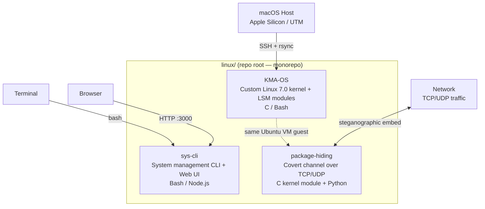
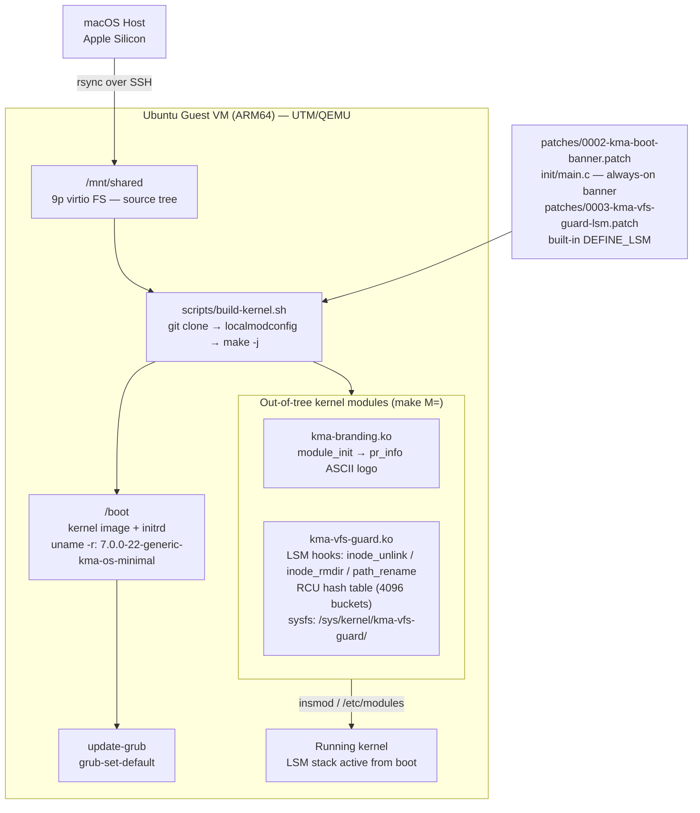
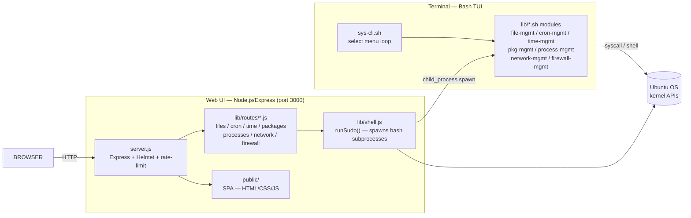
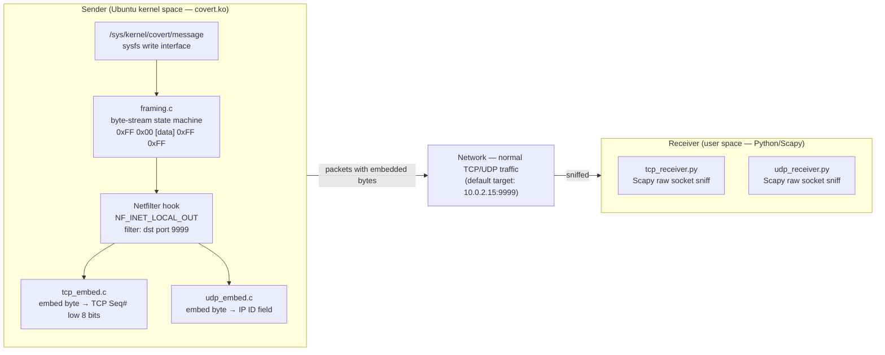

# Architecture

## 1. System Context — Three Independent Sub-Projects

No runtime dependency between the three sub-projects; they share the Ubuntu ARM64 VM as execution environment and the repo as monorepo container only.

---

## 2. KMA-OS — Kernel Build Topology

Key decisions:
- `make localmodconfig` strips ~15 000 config items to ~200 — minimal build footprint
- Boot target <10 s; loaded modules <50
- VFS Guard: RCU lockless O(1) reads; spin_lock only on insert/remove
- Built-in LSM (`DEFINE_LSM`) cannot be bypassed at runtime — enforcement is mandatory

---

## 3. sys-cli — Dual Interface Architecture

Shared logic: both interfaces call the same `lib/*.sh` bash functions — the web layer spawns them as subprocesses via `shell.js:runSudo()`. No business logic duplication.

Security: sudo password in `X-Sudo-Password` header only; 30 s one-time tokens for SSE streams; rate limit 120 req/min; Helmet CSP disabled only for inline scripts.

---

## 4. package-hiding — Covert Channel Architecture

One byte per packet; packet_parser.c identifies target flows; framing.c manages byte sequencing. Receiver is pure user-space Python — no kernel module needed on receiver side. Checksums recalculated after header mutation.

---

## 5. Technology Stack

| Sub-project | Layer | Technology | Notes |
|---|---|---|---|
| KMA-OS | Kernel | Linux 7.0.0 (Ubuntu oracular) | ARM64, custom localmodconfig build |
| KMA-OS | Module language | C (GPL-2.0) | kma-branding, kma-vfs-guard |
| KMA-OS | Kernel API | LSM hooks, sysfs kobject, RCU hashtable | VFS Guard hooks: inode_unlink/rmdir, path_rename |
| KMA-OS | Build | Makefile (kbuild out-of-tree `make M=`) | |
| KMA-OS | VM | UTM (QEMU userspace), 9p virtio FS | macOS host → ARM64 guest |
| KMA-OS | Scripts | Bash | build-kernel.sh, sync-to-vm.sh, test-*.sh |
| sys-cli | CLI | Bash (modular lib/*.sh) | 7 domain modules |
| sys-cli | Web server | Node.js + Express 4 | port 3000, rate-limited |
| sys-cli | Web security | helmet, express-rate-limit | sudo token in-memory, 30 s TTL |
| sys-cli | Web frontend | Vanilla HTML/CSS/JS SPA | static files in public/ |
| sys-cli | Subprocess bridge | shell.js (child_process.spawn) | ties web routes to bash libs |
| package-hiding | Sender | C kernel module (GPL-2.0) | Netfilter NF_INET_LOCAL_OUT |
| package-hiding | Steganography | tcp_embed.c, udp_embed.c, framing.c | 1 byte/packet bandwidth |
| package-hiding | Receiver | Python + Scapy | raw socket, user space only |
| package-hiding | Trigger | sysfs write | /sys/kernel/covert/message |

---

## Unresolved Questions

- `tcp_embed.c` / `udp_embed.c`: exact header subfield used (urgent pointer? reserved bits?) — needs file read to confirm.
- sys-cli `public/` SPA: Alpine.js + HTMX confirmed in scout; bundled vs. CDN not verified.
- package-hiding receiver: byte-order and framing reassembly logic in Python not examined.
