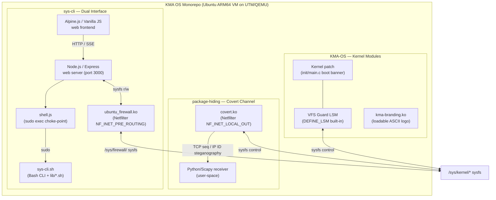
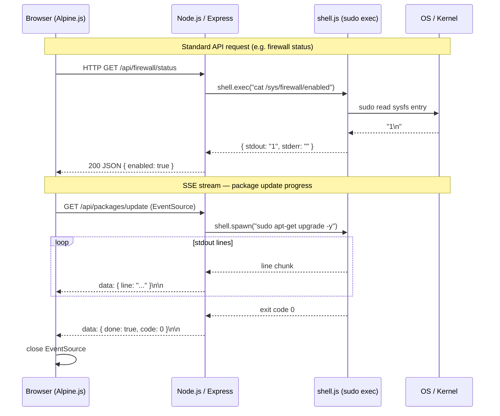

**Project**: KMA OS — Linux Security & Kernel Research Monorepo
**Generated**: 2026-06-22
**Architecture Type**: Multi-subproject monorepo — kernel C, Bash CLI, Node.js web UI, Python

## Executive Summary

Educational mono-repository covering three independent Linux kernel security and systems-programming sub-projects, each targeting a distinct OS-concepts domain: custom kernel construction, network covert channels, and privileged system management. Primary audience: OS-security students and kernel developers at KMA (Vietnam military-communications university).

All three sub-projects run against an Ubuntu ARM64 guest VM hosted on UTM/QEMU on macOS Apple Silicon. No shared runtime dependencies exist between sub-projects; they share only the git root and Ubuntu VM as execution environment.

For architecture diagrams and tech stack details, see [architecture.md](architecture.md).

## System Architecture

### High-Level Architecture

### Technology Stack

| Layer | Technology | Version |
|---|---|---|
| Kernel modules (KMA-OS) | C — Linux kernel build system | Linux 7.0 (KMA-OS target) |
| Covert channel kernel | C — Netfilter API | Linux 7.0 (KMA-OS target) |
| Covert channel receiver | Python, Scapy | Python 3, Scapy 2.x |
| CLI | Bash | 5 |
| Web server | Node.js + Express | Node.js LTS, Express 4 |
| Web frontend | Alpine.js, Vanilla JS | Alpine.js 3.x |
| Build / packaging | GNU Make, shell scripts | — |
| VM host | UTM / QEMU on macOS Apple Silicon | — |

## Data Flow

### sys-cli Web Dashboard — Request Flow

## Key Design Decisions

### Decision 1: Mono-Repo with Three Independent Sub-Projects

**Context**: Three distinct OS topics — kernel customization, covert channels, system management — needed a common home without coupling their build systems or runtimes.

**Decision**: Flat mono-repo layout: `KMA-OS/`, `package-hiding/`, `sys-cli/` each self-contained with their own Makefiles, scripts, and docs.

**Rationale**: Students can study one sub-project in isolation. No cross-sub-project imports or shared libraries. Simpler than a workspace-managed monorepo for an educational context.

### Decision 2: Dual Kernel Integration Strategy (KMA-OS)

**Context**: Kernel branding and VFS protection require different lifecycle properties — boot-time immutability vs. runtime flexibility.

**Decision**: Two complementary mechanisms per feature. Boot banner: kernel patch (`init/main.c`) — always active. VFS Guard: built-in LSM via `DEFINE_LSM` (non-unloadable, boot-registered) plus a parallel loadable-module reference for development. ASCII logo: optional `kma-branding.ko` loadable module.

**Rationale**: Teaches the difference between built-in and loadable kernel code; demonstrates two LSM registration paths (`DEFINE_LSM` vs `module_init` + `security_add_hooks`).

### Decision 3: Netfilter Hook for Covert Channel (package-hiding)

**Context**: Covert channel requires intercepting outbound packets transparently without modifying the application.

**Decision**: `covert.ko` hooks `NF_INET_LOCAL_OUT`. Data embedded into TCP Sequence Number low 8 bits (TCP) or IP Identification field (UDP). Framing protocol: `0xFF 0x00` [data bytes] `0xFF 0xFF`. Receiver is Python/Scapy user-space.

**Rationale**: No application changes needed; demonstrates kernel/user-space split for steganographic comms. Checksums recalculated after mutation to keep packets network-valid.

### Decision 4: Sysfs as Universal Control Plane

**Context**: All kernel modules (VFS Guard, covert channel, ubuntu_firewall) need runtime configuration without recompilation.

**Decision**: Each module exposes a `/sys/kernel/<module>/` directory. CLI and Web UI read/write sysfs entries directly.

**Rationale**: Canonical Linux kernel interface for user-space↔kernel communication. No ioctl, no procfs, no custom device nodes — consistent across all three sub-projects.

### Decision 5: Bash CLI + Node.js/Express Web UI (sys-cli)

**Context**: sys-cli needed both terminal and browser interfaces for privileged system management.

**Decision**: Pure Bash for the CLI (`sys-cli.sh` + `lib/*.sh` modules). Separate Node.js/Express server for Web UI. All shell calls routed through `web/lib/shell.js`. Frontend uses Alpine.js + HTMX — no build step.

**Rationale**: KISS — Bash is native on every Ubuntu system; Node.js adds minimal overhead for the web tier. Single choke-point applies rate-limiting, sudo token management, and audit logging without spreading security logic across route handlers.

## Security Overview

- **Authentication**: None in KMA-OS or package-hiding (educational/local-VM scope). sys-cli web UI uses a one-time sudo token: password arrives in `X-Sudo-Password` header, exchanged for a 30 s TTL single-use token for SSE/EventSource connections. Password is never logged or persisted.
- **Authorization**: KMA-OS VFS Guard enforces path-level protection at the kernel LSM layer — blocks `unlink`/`rmdir`/`rename` on registered inodes regardless of caller privilege (including root). sys-cli firewall module provides netfilter-based packet filtering via sysfs.
- **Data Encryption**: None — educational project; covert channel explicitly documents "no encryption" as a known limitation.
- **API Security**: sys-cli web server applies `helmet` and rate limiting (120 req/min). Kernel sysfs interfaces protected by standard Linux DAC (root-only writes).

## Scalability

- **Current Capacity**: Single-VM / single-host educational deployment. KMA-OS targets a single UTM VM with 8 GB RAM. sys-cli web UI defaults to port 3000; no clustering.
- **Scaling Strategy**: Not applicable — educational scope.
- **Performance Targets**: KMA-OS: boot <10 s, loaded modules <50. VFS Guard: O(1) RCU lockless reads. package-hiding: 1 byte/packet (acknowledged bandwidth limit). sys-cli: no explicit targets.

## Sub-Project Reference

| Sub-Project | Language(s) | Primary Kernel Interface | Entry Point |
|---|---|---|---|
| KMA-OS | C (kernel), Bash | LSM hooks, `DEFINE_LSM`, `module_init` | `scripts/build-kernel.sh` |
| package-hiding | C (kernel), Python, Bash | Netfilter `NF_INET_LOCAL_OUT` | `src/covert/Makefile` |
| sys-cli | Bash, C (kernel), Node.js | Netfilter `NF_INET_PRE_ROUTING`, sysfs | `sys-cli.sh` / `web/server.js` |

## Known Limitations

- package-hiding: 1 byte/packet bandwidth; no encryption; no IPv6; no retransmission on packet loss.
- sys-cli kernel firewall (`ubuntu_firewall.ko`): sysfs at `/sys/firewall/` — inconsistent with VFS guard path `/sys/kernel/kma-vfs-guard/`.
- KMA-OS: no cross-compilation — kernel must be built natively inside the ARM64 Ubuntu VM.
- No inter-sub-project integration — each sub-project is fully self-contained.
